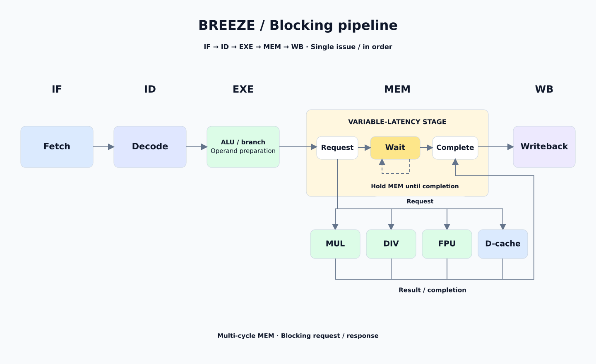
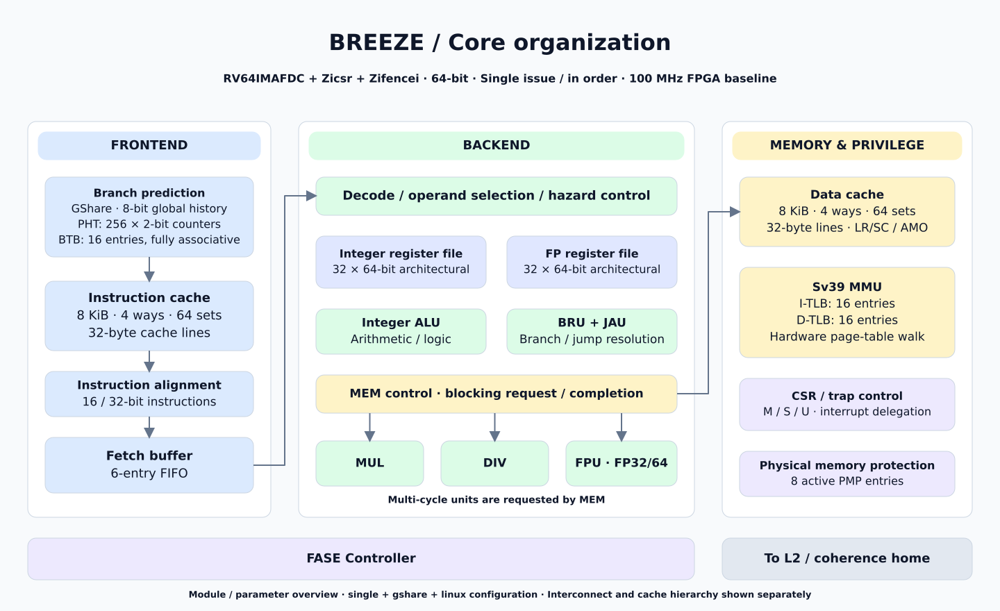
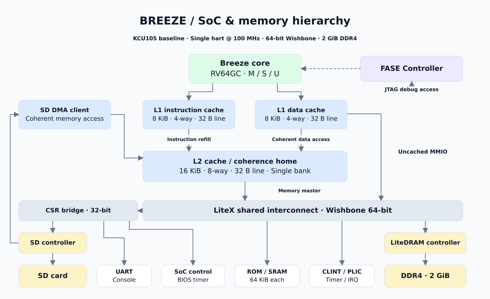

# Breeze RISC-V 处理器

Breeze 是用 Chisel 实现的 RV64GC 顺序单发射处理器。当前版本在 KCU105 上以
100 MHz 运行，配备 2 GiB DDR4，已启动 Buildroot Linux，并运行 Python 和 GAPBS。
SoC 使用 LiteX 集成 DDR、串口和 SD 控制器，FASE 提供独立的 JTAG 调试入口。

本文介绍已上板验证的单核配置。仓库也保留多核配置，本文的性能数据均来自单核。

## 下载与启动

[2026-09-18 发布页](https://github.com/RanxiChen/flow/releases/tag/breeze-kcu105-20260918)
提供配套的 FPGA 与 Linux 镜像，可直接用于 KCU105：

| 文件 | 内容 |
| --- | --- |
| [FPGA 镜像](https://github.com/RanxiChen/flow/releases/download/breeze-kcu105-20260918/breeze-kcu105-100mhz-sd-fase-20260918.zip) | 单核 100 MHz，SD、FASE、硬件记录器；不含 ILA |
| [Linux 启动包](https://github.com/RanxiChen/flow/releases/download/breeze-kcu105-20260918/breeze-linux-gapbs-python-20260918.zip) | Linux、OpenSBI、设备树、启动跳板和 boot.json，包含 GAPBS 与 Python |
| [SHA256SUMS](https://github.com/RanxiChen/flow/releases/download/breeze-kcu105-20260918/SHA256SUMS) | 两个 ZIP 的 SHA-256 校验值 |

FPGA 产物来自 `29ee514`，Linux 配置来自 `b2a895b`，完整提交号记在发布说明中。
镜像保存在 GitHub Release，源码仓库不包含这些大文件。

1. 用 Vivado Hardware Manager 通过 JTAG 加载 FPGA 包中的 `xilinx_kcu105.bit`。
2. 将 Linux 包中 `boot/` 下的全部文件复制到 SD 卡 FAT 分区根目录。
3. 插入 SD 卡，以 115200 波特率连接 FPGA 串口，在 LiteX BIOS 执行：

```text
sdcard_init
sdcardboot
```

BIOS 从 SD 卡将文件装入 DDR，随后经启动跳板、OpenSBI 进入 Linux。登录用户为
`root`，此镜像未设置密码。进入 shell 后可以检查 Python 和 GAPBS：

```sh
python3 --version
gapbs-smoke
```

已验证的 Python 版本为 3.14.6。`gapbs-smoke` 会运行六项小图测试，查看每项输出中的
`Verification: PASS`。

Linux 使用内嵌 initramfs，运行期间的文件写入保存在 RAM，断电后丢失。
这一版由 BIOS 使用 SD 卡加载系统；Linux 挂载 SD 根分区仍在调试，网络尚未验证。

## 微架构

流水线分为 IF、ID、EXE、MEM、WB。普通整数运算在 EXE 完成；乘除法、浮点和数据缓存
访问由 MEM 发起请求，并等待结果返回。MEM 等待期间会阻塞流水线，因此这些单元的
多周期操作会影响整核吞吐。



下图列出前端、执行单元、缓存及特权架构模块。参数对应 `single / gshare / linux` 配置。



| 项目 | 配置 |
| --- | --- |
| 指令集 | RV64IMAFDC、Zicsr、Zifencei |
| 执行方式 | 单发射、顺序执行，阻塞式 MEM |
| 分支预测 | GShare，8 位全局历史，256 项 2 位 PHT；16 项全相联 BTB |
| 取指缓冲 | 6 项 FIFO，支持 16/32 位指令重对齐 |
| L1 I-cache / D-cache | 各 8 KiB，4 路，64 组，32 B 缓存行 |
| L2 / coherence home | 16 KiB，8 路，64 组，32 B 缓存行，单 bank |
| 虚拟内存 | Sv39，I-TLB / D-TLB 各 16 项，硬件页表遍历、SFENCE.VMA |
| 特权架构 | M/S/U，异常与中断委托，8 个有效 PMP 项，Sstc |
| 调试 | FASE：JTAG halt、寄存器访问、指令注入；硬件记录器保存近期执行现场 |

缓存容量不含标签和一致性元数据。实现入口见
[核心配置](design/src/main/scala/config/config.scala)、
[核心连接](design/src/main/scala/core/BreezeCore.scala)和
[MMU](design/src/main/scala/mmu/BreezeMmu.scala)。

## SoC 与存储结构

L1 指令缓存和数据缓存接入 L2/Home，SD DMA 也作为 client 通过该入口访问内存。
L2 的内存请求和核心的非缓存 MMIO 请求进入 LiteX 64 位 Wishbone 总线；外设寄存器
使用 32 位 CSR 接口。LiteDRAM 管理板上的 2 GiB DDR4。



三张图的可编辑 draw.io 文件与 SVG 一同保存在 [docs/figures](docs/figures)。

启动包使用以下加载地址。`boot.json` 的 `addr` 指定执行入口，即启动跳板地址。

| 文件 | 加载地址 |
| --- | --- |
| `fw_jump.bin` | `0x8000_0000` |
| `serial-handoff.bin` | `0x8008_0000` |
| `flow-kcu105-tiny.dtb` | `0x8010_0000` |
| `Image` | `0x8020_0000` |

## 从源码构建

以下命令在仓库根目录执行。FPGA 构建需要 Vivado、Java/sbt、RISC-V 交叉工具链，
以及包含 Migen、LiteX、LiteX-Boards、LiteDRAM、LiteSDCard 的 Python 环境。
请使用适配本项目的 LiteX 环境；仅安装任意版本的上游依赖不能保证复现已发布产物。

### FPGA

```sh
python3 fpga/kcu105/target.py \
    --cpu-type breeze-tiny \
    --sys-clk-freq 100000000 \
    --with-sdcard --with-fase \
    --output-dir build/fpga/kcu105-sd-fase-100mhz \
    --build
```

目标脚本会先通过 sbt 生成 RTL，再构建 LiteX BIOS 并运行 Vivado。
产物为 `build/fpga/kcu105-sd-fase-100mhz/gateware/xilinx_kcu105.bit`。
上述命令启用 FASE 与硬件记录器，不启用 ILA。重新构建后需检查实现时序报告再上板。

### Linux、GAPBS 与 Python

已发布镜像使用 Buildroot 2026.05.1、musl 和 GCC 14.4.0。准备 Buildroot 源码目录后运行：

```sh
BUILDROOT_DIR=/path/to/buildroot bash linux/sd-gapbs/build.sh
```

脚本使用 `flow_tiny_gapbs_defconfig`，编译 Linux 6.18.7、OpenSBI、GAPBS 和 Python，
将根文件系统嵌入 Linux Image，并生成启动跳板与 `boot.json`。

- `build/sd-gapbs/output/`：Buildroot 构建目录及交叉工具链。
- `build/sd-gapbs/boot/`：可复制到 SD 卡 FAT 分区的启动文件及校验值。

构建脚本不写入 SD 卡。它与 Linux SD 根分区配置使用不同输出目录，避免混用镜像。
配置入口为 [Buildroot defconfig](linux/buildroot-external/configs/flow_tiny_gapbs_defconfig)
和[构建脚本](linux/sd-gapbs/build.sh)。

### RTL 测试

```sh
cd design
sbt test
```

仿真环境和定向测试见 [LiteX 仿真文档](sim/litex/README.md)。

## GAPBS 性能

测试平台为 KCU105 单核 Breeze，100 MHz、2 GiB DDR4，使用上述 Buildroot musl 镜像。
GAPBS 源码固定为 `b5e3e19c2845f22fb338f4a4bc4b1ccee861d026`，启用 OpenMP 构建。

| 算法 | 命令 | 顶点数 | 无向边数（程序报告） | Average Time |
| --- | --- | ---: | ---: | ---: |
| BFS | `./bfs -g 18 -n 50` | 262143 | 3805449 | 3.03940 s |
| BC | `./bc -g 18 -n 50` | 262143 | 3805449 | 42.47229 s |

Average Time 是 50 次算法运行的平均耗时，不包含生成图和构图。
两次大图运行未使用 `-v`；正确性检查来自此前六项 `-g 10 -n 1 -v` 小图测试，均为 PASS。
原始串口记录未包含 OpenMP 环境变量，实际线程设置未独立确认。
完整试次与计时记录见 [测试数据](docs/benchmarks/breeze-gapbs-20260918.md)。

后续测量可显式固定线程设置，并保存控制台输出：

```sh
cd /opt/gapbs
export OMP_NUM_THREADS=1
export OMP_DYNAMIC=FALSE
time ./bfs -g 18 -n 50
time ./bc -g 18 -n 50
```
