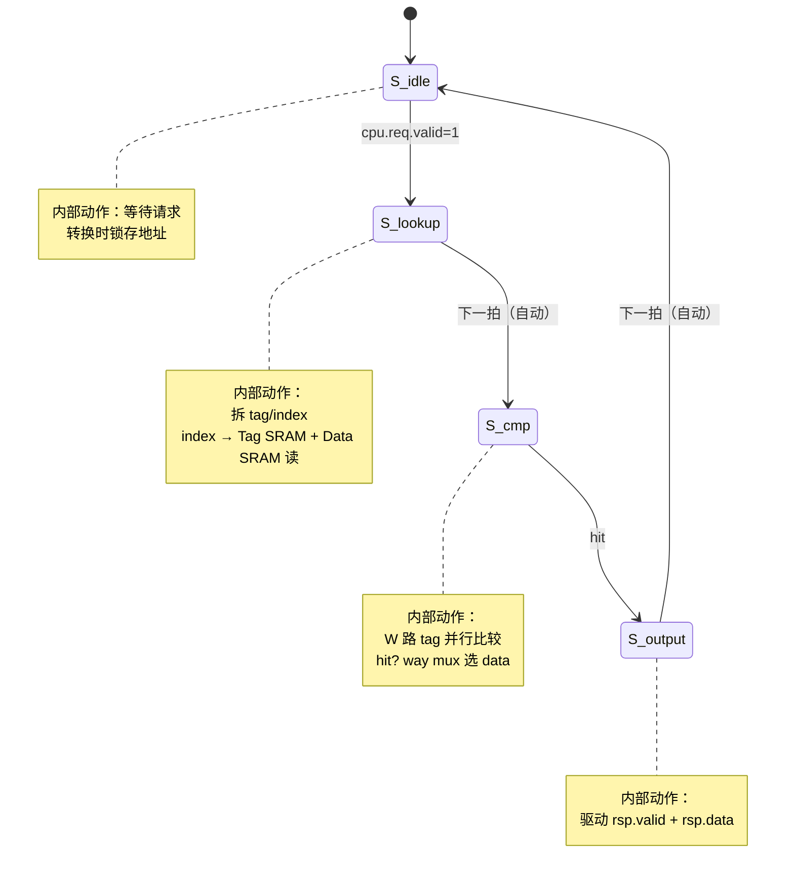

# L1 DCache 组相联设计讨论

> 本文档随讨论逐步填充，记录架构决策、微架构设计和验证方案。

## 1. 目标

将现有全相联 8-entry `BreezeDCache` 替换为组相联 L1 Data Cache。

## 2. 已确认的设计决策

### 2.1 写策略

- **Write-back + Write-allocate**

### 2.2 存储介质

- Tag + Data 均使用 `SyncReadMem`（Chisel SRAM）
- 全相联版的 `Reg(Vec(...))` 放弃

### 2.3 Lookup 两拍流水

- **第 1 拍**：用地址的 index 域发起 Tag SRAM + Data SRAM 读请求
- **第 2 拍**：SRAM 返回数据，W 路 tag 并行比较，way mux 选出命中数据

## 3. Read Hit 状态机

### 3.1 状态转移图



### 3.2 ASCII 状态图

```
                    ┌──────────────────┐
   cpu.req.valid    │                  │
 ──────────────────►│      S_idle      │◄─────────────────
                    │  (等待请求)       │                  │
                    └────────┬─────────┘                  │
                             │  cpu.req.valid=1           │
                             ▼                            │
                    ┌──────────────────┐                  │
                    │     S_lookup     │                  │
                    │  拆 tag/index    │                  │
                    │  index→SRAM 读   │                  │
                    └────────┬─────────┘                  │
                             │  下一拍(自动)               │
                             ▼                            │
                    ┌──────────────────┐                  │
                    │      S_cmp       │                  │
                    │  W路tag并行比较   │                  │
                    │  hit? way mux    │                  │
                    └────────┬─────────┘                  │
                             │  hit                       │
                             ▼                            │
                    ┌──────────────────┐                  │
                    │     S_output     │──────────────────┘
                    │  驱动 rsp 端口    │   下一拍(自动)
                    └──────────────────┘
```

### 3.3 逐状态职责

| 状态 | 做什么 | 关键动作 |
|------|--------|---------|
| `S_idle` | 等待 CPU 请求 | `cpu.req.valid=1` 时锁存地址，转 `S_lookup` |
| `S_lookup` | 发出 SRAM 读 | 地址拆 tag/index；index 给 Tag SRAM + Data SRAM |
| `S_cmp` | 比较 + 选路 | SRAM 返回 tag+data；W 路 tag 并行比较；way mux 选 data |
| `S_output` | 驱动输出 | `rsp.valid=1`，`rsp.data` 送出，转回 `S_idle` |

### 3.4 信号级时序

```
Signal              Cycle N       Cycle N+1      Cycle N+2       Cycle N+3
────────────────────────────────────────────────────────────────────────────
state               S_idle        S_lookup       S_cmp           S_output

io.cpu.req.valid    ▔▁            ▁              ▁               ▁
io.cpu.req.addr     A             X              X               X

reqAddr (reg)       X             A              A               A

SRAM read index     X             A[index]       X               X
SRAM read data out  X             X              tag[W]+data[W]  X

hit_vector          0             0              ▔/▁            0
way_mux_data        X             X              selected_word   X

io.cpu.rsp.valid    ▁             ▁              ▁               ▔▁
io.cpu.rsp.data     X             X              X               D
```

**说明**：
- `reqAddr` 在 Cycle N (S_idle) 锁存，Cycle N+1 (S_lookup) 用它的 index 域发 SRAM 读
- Cycle N+2 (S_cmp) SRAM 返回 tag+data，与 `reqAddr` 的 tag 域比较
- Cycle N+3 (S_output) 把数据发回 CPU，然后回到 S_idle

### 3.5 全相联 vs 组相联：Read Hit 延迟对比

| | 全相联 | 组相联 |
|---|---|---|
| 请求 → 响应 | 2 拍 (Idle→Lookup→Respond) | **3 拍** (S_idle→S_lookup→S_cmp→S_output) |
| 多出的 1 拍 | — | SRAM 同步读延迟 |
| Data Array | Reg(Vec) 组合读 | SyncReadMem 同步读 |

## 4. 待讨论

- [ ] 参数：sets × ways × lineBytes
- [ ] 替换策略（PLRU / random / LRU）
- [ ] Read miss 路径（writeback → refill → merge）
- [ ] Write 路径：hit write 的 read-modify-write 时序
- [ ] L2/L3 架构
