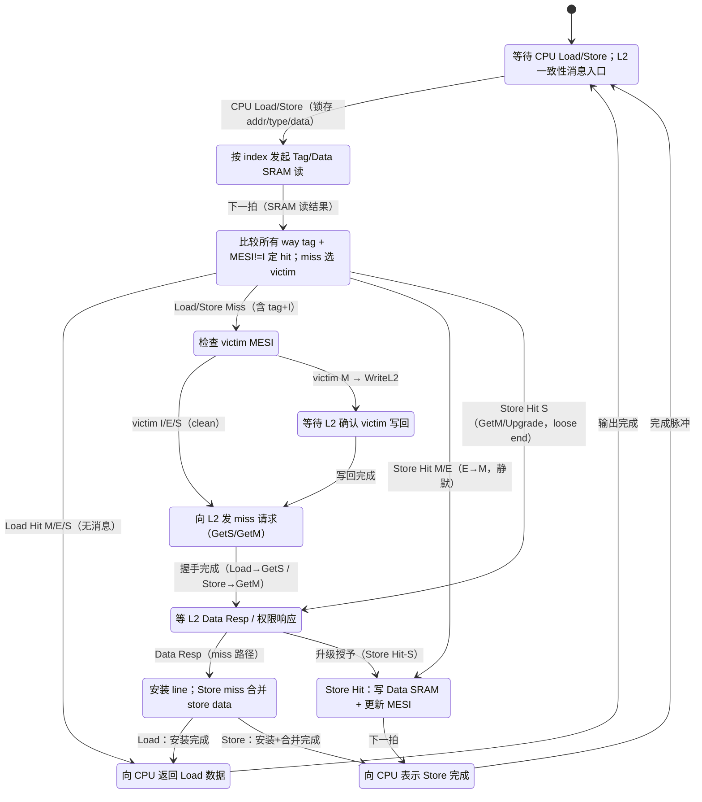
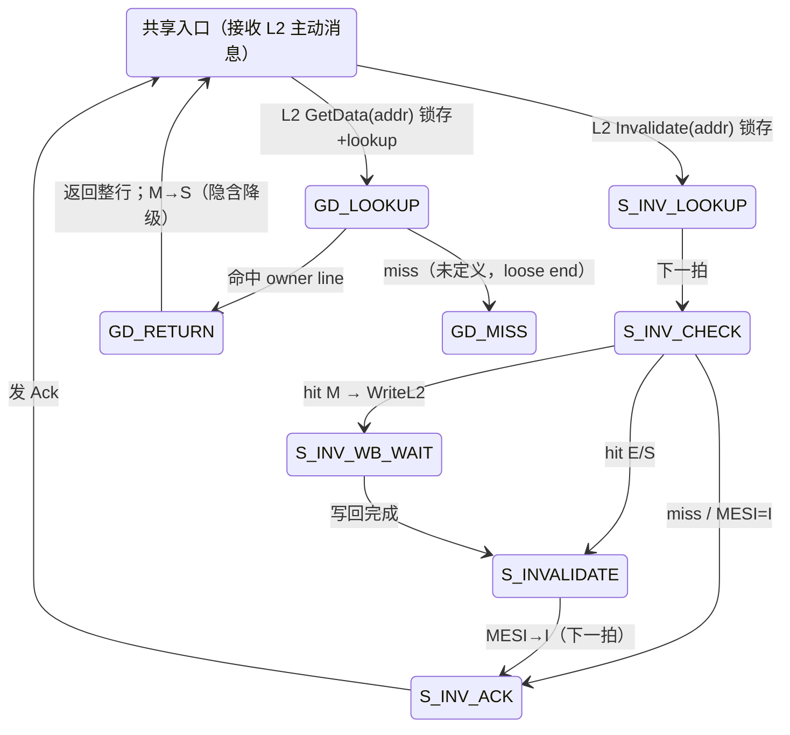
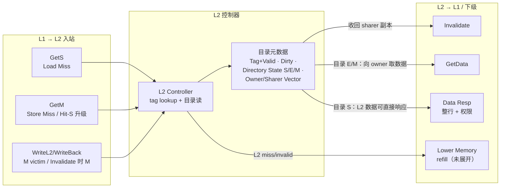

# MESI L1/L2 缓存一致性状态机（当前设计）

来源：`MESI_L1_L2_State_Machine_Current_Design.docx`。只画**已讨论定稿**的部分，L2 完整目录状态机、并发/MSHR 等未展开内容不擅自补全（对应文档 §10）。

## 1. L1 CPU 请求主 FSM

## 2. L1 L2 主动路径（Invalidate + GetData，共享 S_IDLE）

## 3. L2 一致性概览（概念图，非完整 FSM）

## 关键约定（来自文档）

- L1 hit = tag match 且 MESI != I；tag match + MESI==I 仍按 miss。
- L1 的 E→M **静默**（不通知 L2）→ L2 目录看到 E 不能假设自身 Data SRAM 最新，E/M 都可能需向 owner 取数据。
- Write-Allocate + Write-Back；SRAM 同步读（Lookup 发读、下一状态取结果）。
- 当前 L1 控制器按**阻塞式**理解（一个 miss 事务未完成前不接受会破坏它的事务）。

## 未完成项（对应文档 §10，暂不展开）

- L2 GetS/GetM 完整状态转移、memory refill。
- L2 多 sharer Invalidate/Ack 计数、owner data 回收。
- L2 replacement + inclusive eviction。
- GetData 是否拆 FetchShared / FetchInvalidate。
- 并发/非阻塞（MSHR、transaction ID、多 outstanding）未纳入第一版。
